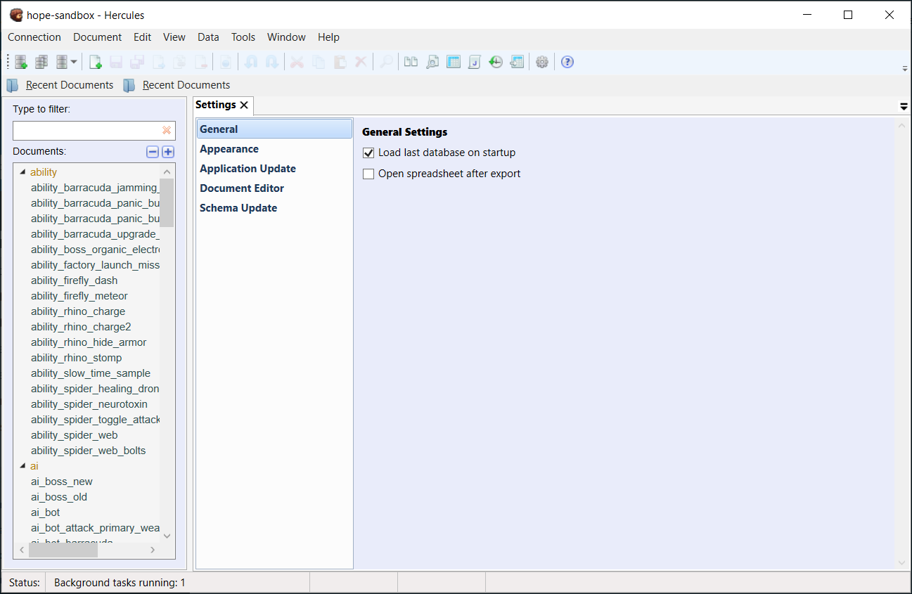
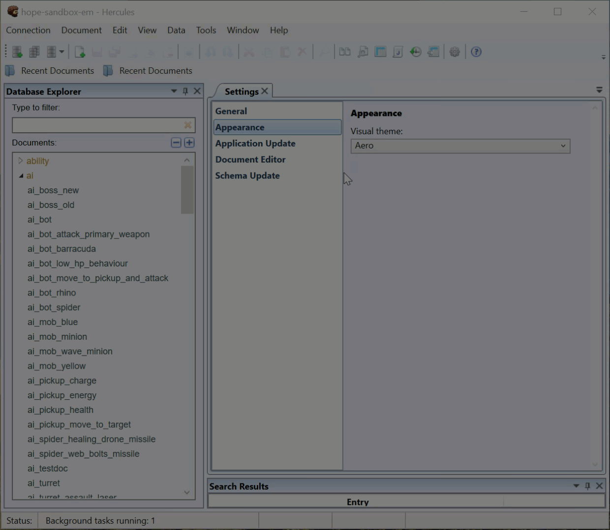

Hercules Settings
====================

Hercules provides a settings menu where you get to select parameters that determine how the program and its tools behave.

To open **Settings**, do any of these:

-  Click the Settings icon on the toolbar.

-  Go through **Tools** > **Settings**.

.. _general:

**General**
---------------

-  .. rubric:: Startup
      :name: startup

..

   If you want Hercules to open the last database when the program starts, tick the **Load last database on startup** checkbox.

-  .. rubric:: Export
      :name: export

..

   If you want Hercules to open the spreadsheet immediately after the export operation, tick **Open spreadsheet after export** checkbox.

The changes become effective immediately.

**Appearance**
------------------

To change Hercules’ visual theme, click the drop-down menu and then select your preferred theme.

The changes become effective immediately.

**Application Update**
--------------------------

-  .. rubric:: Checking for updates
      :name: checking-for-updates

..

   If you want Hercules to check for updates automatically every time you open the program, tick the **Check for application updates on launch** checkbox.

-  .. rubric:: Update channel
      :name: update-channel

..

   To change the update channel, click the drop-down menu and then select your preferred update channel.

	-  **Stable**: This is the default channel. We strongly recommend you to select Stable unless you have reasons to use another channel.

	-  **Beta**: If you want to test new features, select this channel.

	-  **Development**: This is a special channel for developers.

..

-  .. rubric:: Instant Check For Updates

To force Hercules to check for updates right now, click the **Check for updates now** button.

**Document Editor**
-----------------------

Documents Opening Behavior
^^^^^^^^^^^^^^^^^^^^^^^^^^

-  **Expand root elements**: If you want Hercules to automatically expand nested elements when it opens a document, select this option.

-  **Expand elements recursively:** If you want Hercules to automatically expand **all** elements (nested elements, the nested elements inside nested elements, etc.) when it opens a document, select this option.

-  **Do not expand:** If you do **not** want Hercules to expand nested elements when it opens a document, select this option.

Documents Creation Behavior 
^^^^^^^^^^^^^^^^^^^^^^^^^^^

-  Expand root elements.

-  Expand elements recursively.

-  Do not expand.

Field Name Alignment Position
~~~~~~~~~~~~~~~~~~~~~~~~~~~~~

Select your preferred position (**Left** or **Right**) for field names in Hercules.

Max Nested Value Offset
~~~~~~~~~~~~~~~~~~~~~~~

Type in a value that determines the maximum number of characters.

Number Editor 
~~~~~~~~~~~~~

If you always want to see the spin buttons that allow you to increase and decrease the number in a field by specific amounts, tick the **Show spinner buttons** checkbox.

You can also select your preferred position (**Left** or **Right**) for numeric values alignment.

Enumeration Editor
~~~~~~~~~~~~~~~~~~

If you want Hercules to display entries on the lists in alphabetical order, tick the **Sort options alphabetically** checkbox.