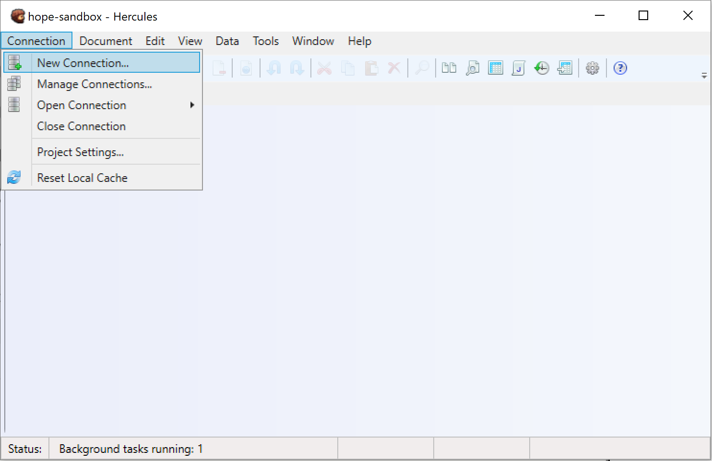

Connections
===============

Databases and Connections
-----------------------------

To use Hercules normally, you have to connect to a database. Hercules then loads the database and displays its contents.

At any given point in time, a **single Hercules instance** can connect to **only one** **database**.

.. important::
    * When Hercules is already connected to a database and you try to connect to another database directly, Hercules terminates the active connection and initiates the new connection.
    * But you can run **several instances** of Hercules to initiate connections to **different** databases simultaneously.

.. _new-connection:

Setting Up a New Connection
-------------------------------

You can set up a new connection through any of these methods:

-  Go through **Connection** > **New Connection**.

-  Go through **Connection** > **Manage Connections**. On the **Manage Connections** window, click **New.**

-  Click the **New Connection** icon on the menu bar.

On the **New Connection** window:

-  **Title**: Type in a name for the connection. Give the connection a name that helps you to identify it quickly.

.. warning:: Every connection should have a unique name.

-  **URL**: Type in the URL or path where your CouchDB currently resides.

-  **Username**: Type in your username.

-  **Password**: Type in your password.

-  **Database**: Click the drop-down menu to see the available databases. Select the database to which you want to connect.

Click **Apply** to finish.

.. figure:: images/manual/image8.gif

Switching Between Existing Connections 
------------------------------------------

In Hercules, you can establish only one connection to a database at a time. To work with a different database, you have to close the active connection and establish a new one. 

From the **Connection** menu, you can quickly switch from one connection to another (assuming you previously connected to the databases).

Go through **Connection** > **Open Connection**. Select the connection to which you want to switch.

.. figure:: images/manual/image9.gif

.. note:: The active connection name is always displayed on Hercules’ title bar.

Managing Connections
------------------------

Go through **Connection** > **Manage Connections**.

On the **Database Connections** window, you get to manage existing connections.

The **active connection** appears in **bold**.

.. figure:: images/manual/image10.gif

-  .. rubric:: Editing Connections
      :name: editing-connections

This is how you make changes to the setup for an existing connection:

1. Go through **Connection** > **Manage Connections**.

2. Select the connection you want to edit. Click the **Edit** button.

3. Make the necessary changes.

4. Click **Apply**.

-  .. rubric:: Deleting Connections
      :name: deleting-connections

Since a connection is just a link to a database, deleting one does not affect the database or its data in any way.

This is how you delete a connection:

1. Go through **Connection** > **Manage Connections**.

2. Select the connection you want to delete.

3. Click the **Delete** button.

4. Click **Yes** to confirm the operation.

-  .. rubric:: Sorting Connections
      :name: sorting-connections

Go through **Connection** > **Edit Connections**.

Select a connection and then click an arrow button to move it up or down.

.. figure:: images/manual/image11.gif

-  .. rubric:: Closing Connections
      :name: closing-connections

To close an active connection, go through **Connections** > **Close Connections**.