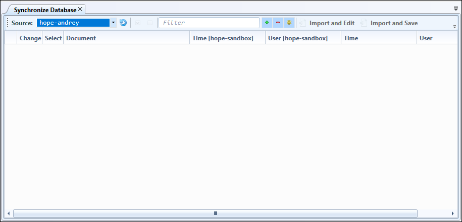
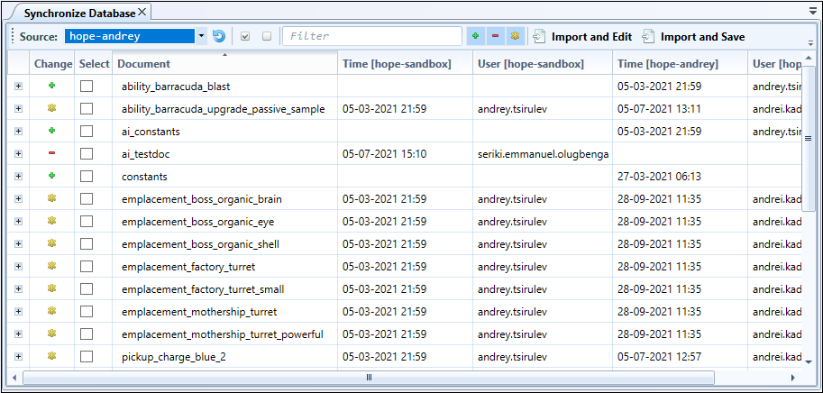
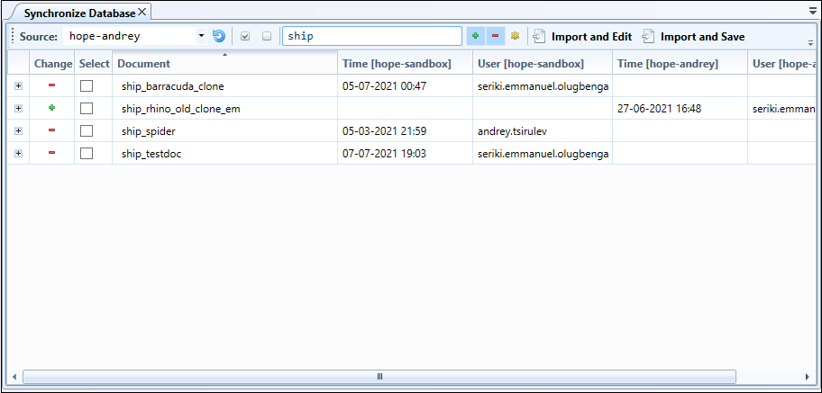
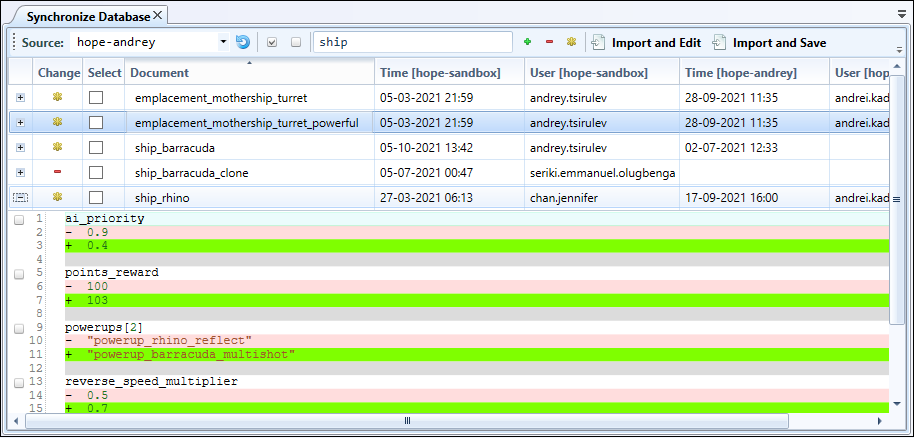

Data Synchronization
=======================

You can force Hercules to synchronize data between databases. This allows you to keep different branches of a product (i.e., dev, beta, stable, live).

To understand the basic synchronization process, consider two databases:

-  A **target database**. This is the database **to** which data is **imported**.

-  A **source database**. This is the database **from** which data is **exported**.

Data is considered unsynced when:

-  the **source database lacks** a document that exists in the target database

-  the **target database lacks** a document that exists in the source database

-  **different versions** of the same document exist in the databases.

Hercules imports unsynced data from the source and target databases to the synchronization form and then exports selected data from the synchronization form to the target database.

Hercules allows you to update a target database with documents from a source database by 

-  importing all unsynced documents

-  importing only specific fields from one document or several documents.

Loading Unsynced Data to the Synchronization form
-----------------------------------------------------

This is how you load unsynced data to a synchronization form:

1. Go through **Data** > **Synchronize With Database**.

2. From the **Source** list, select your preferred source database. 

3. Click |Test|.

.. |Test| image:: images/manual/image59.png

.. important:: You can select the source database only from existing connections available on the **Source** list. If your preferred source database is missing from the list, you have to set up a connection to this database first (see :ref:`Setting Up a New Connection <new-connection>`).

A list of all unsynced changes between the source and target (the one you are currently connected to) database is displayed.

-  **Change** indicates the type of change

-  **Select** selects the entire document for synchronization

-  | **Document** displays the name and ID of the document

      | **Time [Database Name]** is the time and date of the last change in the target database
      | **User [Database Name]** is the name of the user that made the last change in the target database
      | **Time [Database Name]** is the time and date of the last change in the source database
      | **User [Database Name]** is the name user who made the last change in the source database.

Filtering Unsynced Data
---------------------------

Using the filter in the synchronization form, you can find and analyze specific changes quickly. You can filter data based on:

-  document name/id and/or

-  the type of change.

When you add a filter, only documents that meet the specified criteria are shown.

To filter data by document name/ID, type in a string that matches any part of the document name or ID.

.. figure:: images/manual/image62.png

To filter data by type of change, use the buttons to the right of the filter box:

|Plus| (green plus sign) - displays added documents

|Minus| (red minus sign) - displays deleted documents

|Asterix| (yellow asterisk sign) - displays modified documents

.. |Plus| image:: images/manual/image63.png

.. |Minus| image:: images/manual/image64.png

.. |Asterix| image:: images/manual/image65.png

.. figure:: images/manual/image66.png

When you use multiple filtering options, Hercules displays documents that match all of them.

Viewing Modification Details
--------------------------------

In modified documents, the highlight color indicates the type of change:

-  **Green:** Added

-  **Red:** Removed

Selecting Data for Synchronization
-----------------------------------

To select data for synchronization, tick the checkboxes close to documents’ names.

-  When you select a document marked as added, Hercules creates a copy of this document in the target database.

-  When you select a document marked as removed, Hercules deletes the document from the target database.

-  Modified documents are synced with their source counterparts.

To select or deselect all documents in a list, use the **Check all** or **Uncheck all** buttons on the toolbar (under the **Synchronize Database** tab).

The highlight color indicates the type of selected unsynced change:

-  **Yellow:** Modified

-  **Green:** Added

-  **Red:** Removed

.. figure:: images/manual/image69.png

Documents that have been modified may be partially imported this way: Expand the document selection by clicking the plus sign close to the document name. Hercules then displays a comparison view showing document modifications in detail (similar to versioning).

Here, you can specify individual fields that Hercules must synchronize. The specified fields will be imported. The rest of the document will remain untouched. Partially selected documents acquire the black square symbol on the select column.

.. figure:: images/manual/image70.gif

Running Synchronization
--------------------------------

You can run synchronization through any of these methods:

-  **Import and Edit** (you then have to save changes).

-  **Import and Save.**

When unsynced data contain documents marked as removed, you are prompted to confirm the deletion.

.. figure:: images/manual/image71.png
	:align: center