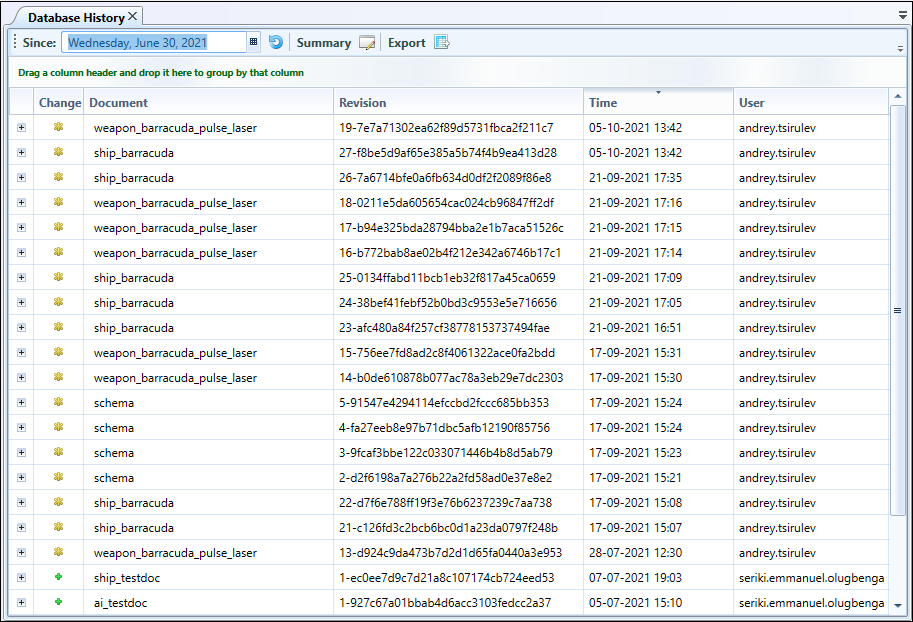
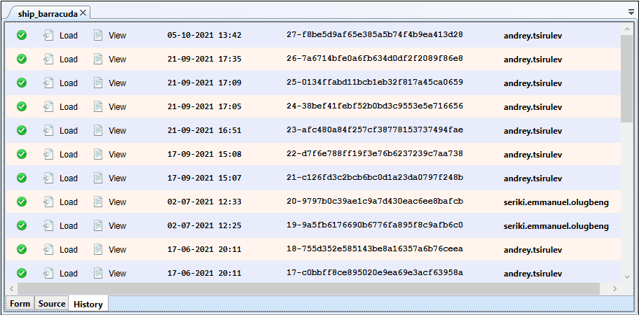
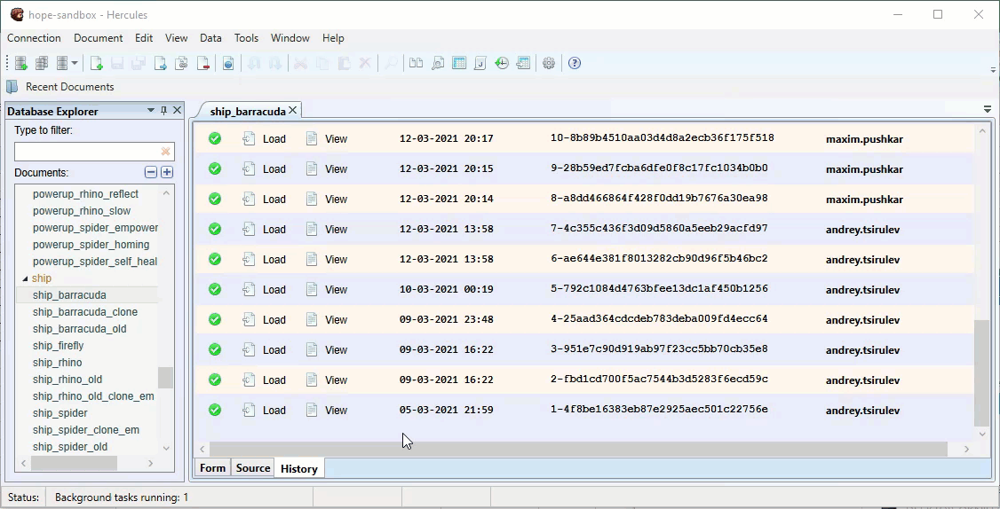
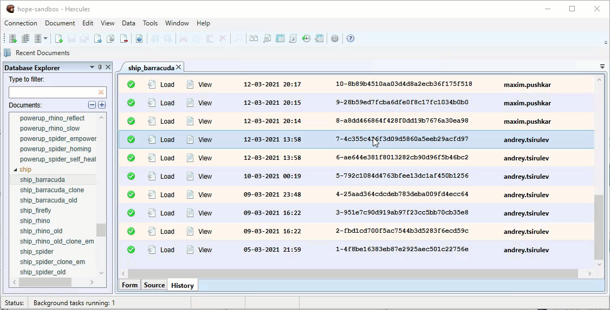
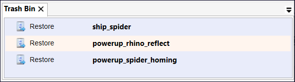

Document Version Control
===========================

Analyzing Database History
------------------------------

In Hercules, you can easily find out who edited a database and the changes they made.

To access the database history, do any of these:

-  Go through **Data** > **Database History**.

-  Click the Database History button on the toolbar.

By default, Hercules displays the history for the current day only.

To view the history for a certain period, use the date picker to specify the start date in the **Since** field and then click **Refresh**.

The database history displays the following:

-  changed document’s name

-  revision number and its hash value

-  date and time the change was made

-  user who introduced the change.

Using the **Export** button at the top of the tab, you can export a database history to a spreadsheet file.

Working with Document History and Versions
----------------------------------------------

Hercules tracks changes made to a document, so you can always find out:

-  **when** a document was changed

-  **who** made the changes

-  **what** exactly was changed.

To access a document’s history, open the document and then click the **History** tab.

.. figure:: images/manual/image54.png

Hercules provides a list of records with information on all versions (revisions) of the document.

The records are organized in reverse chronological order: a record containing information on the latest version is displayed at the top of the list.

Document history also provides information on creation dates, version numbers, and other users that made changes to the document.

To view the differences between the current and previous versions of a record, hover your cursor over the change entry.

The **History** tab only shows how the selected version differs from the previous version. It does not display changes made to the current version of the document.

**Loading a version**

From the **Load** column, you can load a specific document version. To load data from a record into the form tab, click the **Load** button.

.. note:: You can configure the database to delete old document versions automatically. The green tick indicates that the document version is present and available for download.

Loading the data for a document does not cause the document to change. When you load a document, the changes for the data are simply filled in—the document changes only after you (deliberately) save the changes. Therefore, you can safely load, review, and modify data.

To revert the document to the loaded version, click **Save**.

To view the full details for changes involving a specific document version in a separate tab, click the **View** button.

.. hint:: You can open multiple document versions simultaneously in separate tabs.

Recovering Deleted Documents
--------------------------------

Hercules allows you to recover deleted documents. When you delete documents, they are sent to the **Trash Bin** on the database server where they are retained for a specific period of time defined in the CouchDB configuration file. During this period, you can recover any deleted document. After the retention period expires, recovery becomes impossible.

To recover a deleted document, do this:

1. Go through **Data > Trash Bin.**

..

   All documents deleted from the database are displayed on the **Trash Bin** tab.

2. Under **Trash Bin**, select the document you want to recover. To select multiple documents, use Ctrl and Shift.

3. Click **Recover**.