.. _documents:

Documents 
===============

Every document consists of key-value pairs known as fields.

A document name is stored inside the document itself in a special field named \_id.

All documents are divided into categories. A category has a

-  **Name**. We recommend you prefix document names with the name of the category to which they belong.

.. figure:: images/manual/image12.gif

-  **Schema**. All documents in a category comply with the schema for that category. For example, they all have the same fields with the same types of values.

.. figure:: images/manual/image13.gif

A category’s schema determines the data types, fields, and visual editors used for its documents. But in any document, you can still create additional (custom) fields that are not defined by the schema.

When you open a document, Hercules displays:

-  the schema-defined fields (required and optional fields)

-  visual editors required by the schema

-  custom fields (if available)

Only defined data types are allowed in required fields and visual editors.

Arbitrary JSON data can be stored in custom fields.

.. hint:: Under **Database Explorer**, documents are grouped by categories.

Opening Documents 
---------------------

To view a document and edit its contents, you have to open it. You can open a document through any of these methods:

-  Locate the document on the **Database Explorer** tab. Double-click the document name.

-  Use the **Ctrl + O** shortcut or go through **Document** > **Open Document**. Type in the document name and then click **OK**.

.. note:: While you are typing in a document name, Hercules filters matching documents into a list.

Hercules opens individual documents in separate tabs. So, you can have multiple documents open at any given time.

This is how you open several documents at once:

1. Hold the Ctrl key. Click the documents you want to open.

2. Right-click your selection. Select **Edit**.

Opening Documents In Tabbed Groups
--------------------------------------

You can open documents in vertical and horizontal tabbed groups. This way, you can arrange documents side by side for a better working experience.

To display documents in tabbed groups, do this:

-  Open two or more documents.

-  Right-click a document tab and then select either **New Horizontal Tab Group** or **New Vertical Tab Group**.

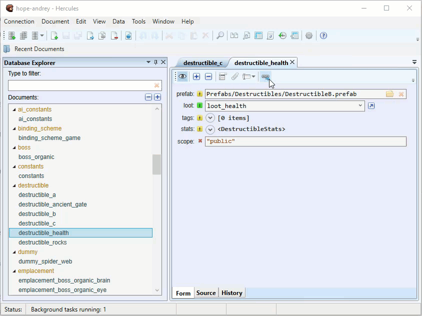

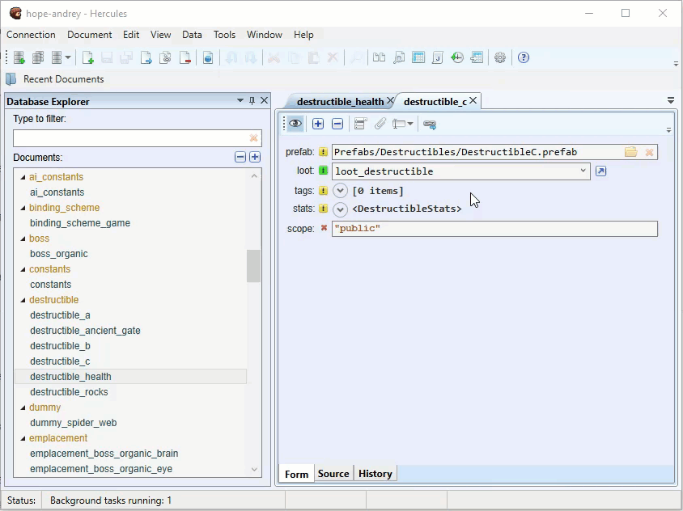

.. tip:: You can create multiple tabbed groups in the program window.

You can easily rearrange documents between tabbed groups through any of these methods:

-  Drag and drop documents between tabbed groups

-  Right-click a document name and then select **Move To Next Tab Group** or **Move To Previous Tab Group**.

When you open new documents, they are displayed in the active tabbed group. To change the active tabbed group, click the tab of any document in the group.

Closing Documents
---------------------

You can close a single document through any of these methods:

-  Click the **Close** button on the document tab.

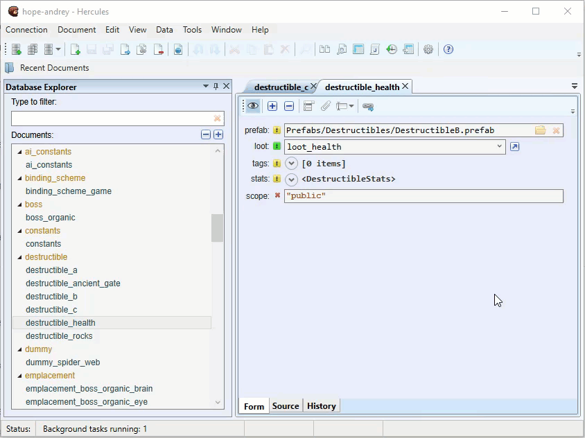

-  Right-click the document name (at the top of the tab) and then select **Close**.

To close multiple documents, right-click a document name and then select either of these:

-  To close all the currently opened documents, click **Close All.**

-  To close all the currently opened documents besides the selected document, select **Close All But This.**

.. figure:: images/manual/image17.gif

Creating New Documents
--------------------------

To create a new document, do this:

1. Access the **Creating new document** command through any of these methods:

-  Go through **Document** > **New** > **New Document**.

-  Right-click a category in the Database Explorer and then select **New Document**.

-  Use the Ctrl + N shortcut.

2. Type in a **name** for the document and select your preferred **category.**

3. Click **OK**.

The new document appears as a tab. Once you are done, save the changes *(*\ see `Saving Documents <#saving-documents>`__\ *)*.

.. note:: If you need a new document that will contain values similar to those in an existing document, you are better off copying the existing document to get the new document. The cloning process is faster since you won’t have to fill all the fields. You can simply edit the necessary fields. For more information, see `Cloning Documents <file:///C:\manual.rtf>`__\ *.*

Viewing Documents
---------------------

After you open a document in Hercules, you can switch between different view modes.

.. figure:: images/manual/image18.gif

-  **Form** provides a convenient way for you to edit the document.

-  **Source** shows the document’s raw JSON contents and allows you to edit them

-  **History** allows you to review changes and load previous versions of the document.

.. hint:: When a document contains diagram data, you can view the diagram in a separate tab. For more information, see `Working With Diagrams <#working-with-diagrams>`__\ *.*

Comparing Documents
-----------------------

In Hercules, you can quickly compare two documents and highlight differences between them.

To compare two documents, do this:

1. From the toolbar, click **Compare documents**.

.. figure:: images/manual/image19.gif

2. Under **Database Explorer**, locate the two documents you want to compare.

3. Drag these documents to the **Compare Documents** tab.

.. figure:: images/manual/image20.gif

The differences between the documents are highlighted:

-  Modified data are highlighted in green

-  Missing data are highlighted in grey

Renaming Documents
----------------------

To rename a document, do this:

1. Access the **Rename Document** function through any of these methods:

-  Under **Database Explorer**, right-click the document and then select **Rename**.

-  Click the document (to get it highlighted) and then go through **Document** > **Rename Document**.

-  Click the document (to get it highlighted) and then press F2.

2. Type in your preferred name for the document. Click **Rename**.

**Dealing With References When Renaming Documents**

If the document you are trying to rename has been referenced in other documents, you have to specify whether you want Hercules to replace the document’s old name in the fields with its new name.

Use the **Check All** and **Uncheck All** buttons to quickly select or deselect fields.

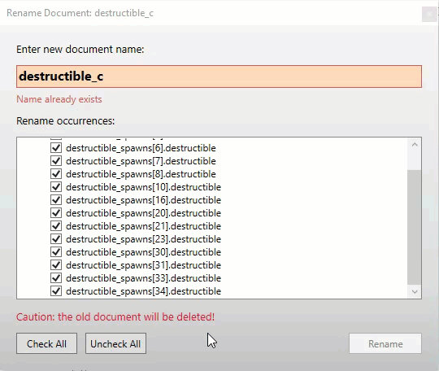

.. warning:: We strongly recommend you leave all fields selected. If you deselect a field and rename the document, the documents that contain references to the renamed document will become invalid.

Click **Rename** and then click **Save All.**

.. important:: When renaming documents that appear as references in other documents, after you click **Rename**, you have to *use* the **Save All** function (**Ctrl + Shift + S**) to save all the changes made to other documents and keep references consistent.

.. note::
 * CouchDB does not provide a document renaming function. When you rename documents, Hercules performs a series of steps (cloning, finding & replacing, and deleting) to achieve the renaming goal.

 * The same *naming rules and conventions* apply when you rename documents.

Filtering Documents in Database Explorer
--------------------------------------------

To filter documents, type in a filter string into the text box. 

.. figure:: images/manual/image22.gif

.. note:: The filtering for strings is case-sensitive. 

Filtering is based on a "contains specific text" logic.

Searching for Data
----------------------

When you are working in a database that contains many documents, you may struggle to remember where every item or detail is located. In that, you can use the **Search** function to find things quickly.

This is how you search for something in Hercules:

1. Access the **Search** function through any of these methods:

-  Use the Ctrl + Shift + F shortcut.

-  Go through **Data** > **Search in Documents**.

2. Provide some details:

   a.   **Find What**: Type in the query (the string or number you want to find).

   b.  **Look In:** If you want Hercules to go through only the documents currently opened as tabs when searching for the query, tick the **Opened documents only** checkbox.

   c. **Categories**: If you want Hercules to go through only certain categories when searching for the query, you can:

		-  select the categories or

		-  specify the type of query:

			-  **Text**: If you want Hercules to go through all text strings in documents while excluding document names, tick this checkbox.

			-  **Document names**: If you want Hercules to go through the names of documents, tick this checkbox.

			-  **Options (enums)**: If you want Hercules to go through the selections in drop-down menus in documents, tick this box.

			-  **Numbers:** If you want Hercules to go through numbers (integers, decimals, etc.), tick this checkbox.

			-  **Field names:** If you want Hercules to go through the names of the fields (texts mostly), tick this checkbox.

   d. **Options**: Specify options that affect the search criteria.

		-  **Match case**: If you want Hercules to find only strings that exactly match the query (uppercase and lowercase characters), select this option.
			When **Match Case** is selected, a search for “\ *Word*\ ” won’t find “\ *word*\ ”.

		-  **Whole word**: If you want Hercules to find only exact match instances of texts, select this option.
			When **Whole word** is selected, a search for “\ *dev*\ ” will only find “\ *dev*\ ” and won’t find “\ *developer*\ ”.

3. Click **Search**.

**Reviewing Search Results**

Under **Search Results**, you can examine the results (hits) of your search.

To see the list of hits found inside a specific document, click the expansion icon.

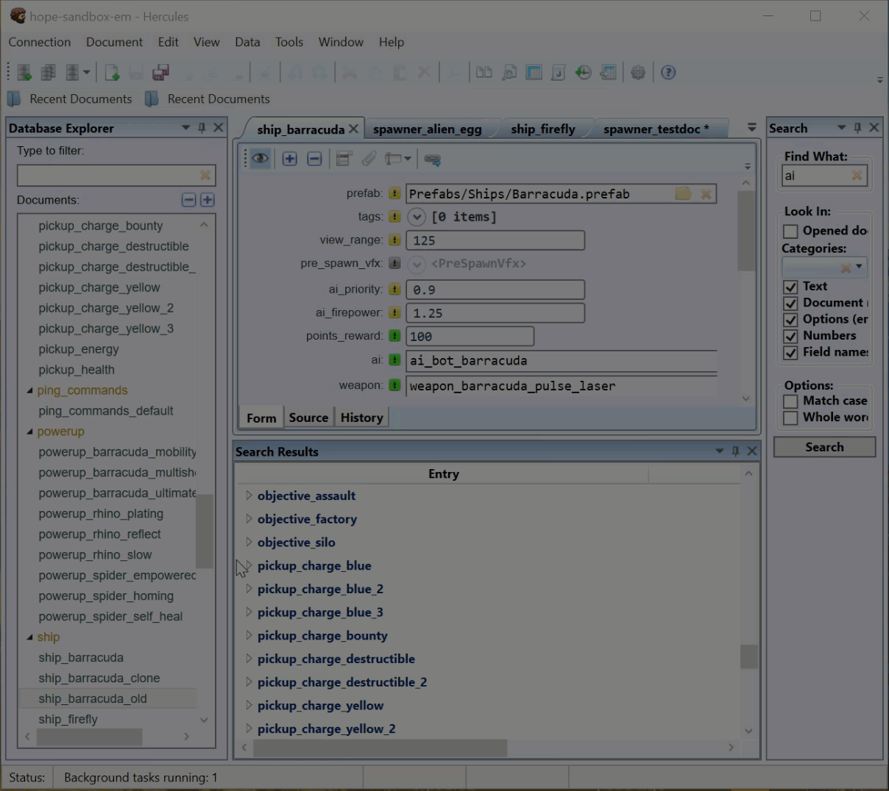

Double-click a hit to open the document containing it and navigate to
its position in the document.

.. figure:: images/manual/image24.gif

Finding References To a Document
-------------------------------------

Hercules can find all documents that contain references to a certain document in the database. This way, you can quickly edit the references.

To find documents that contain references to a certain document in the database, do this:

1. Under **Database Explore**\ r, select a document.

2. Run the search through any of these methods:

   -  Go through **Document > Find references**.

   -  Under **Database Explorer**, right-click the document and select **Find References.**

   -  Under **Database Explorer**, select the document and then press **F6.**

Under **Search Results**, all documents that contain references to the selected document are displayed.

To expand a document and see the hits it contains, click the small arrow close to its name.

.. figure:: images/manual/image25.gif

When you double-click a hit, Hercules directs you to the location of the reference in the document.

Editing Documents
----------------------

Hercules provides different functions or paths to editing documents:

-  You can use the **Form** view to change values in fields

-  You can use the **Source** view to directly edit JSON data

-  In **Diagram** view (if available), you can change the form of the diagram to edit its data

-  You can edit multiple documents simultaneously under the **Summary table**.

When you edit documents, remember that:

-  Documents with **unsaved changes** have an **asterisk** close to their names. After you save the changes, the asterisk disappears.

-  **Valid unchanged fields** have a **white background** and **white text**.

-  **Valid changed fields** (unsafe fields) have a **green background** and **green text.**

-  **Invalid fields** have a **red background** and **red text**.

.. warning:: A saved document can still become invalid due to schema changes.

**Required Fields** have the **yellow exclamation** icon. These fields must contain **valid data**.

**Optional Fields** have the **green exclamation** icon when enabled or the **gray exclamation** icon when disabled.

To enable or disable an optional field, click its exclamation icon.

When an optional field is enabled, it has to contain valid data.

Viewing and Editing Documents in Source View
-------------------------------------------------

To view and edit JSON source code in a document directly, do this:

1. Open the document.

2. Switch to the **Source** view.

3. View and edit source code as necessary.

4. Click **Submit changes to Form** on the toolbar to validate your changes, and then click **Save**.

.. tip:: The **Source** view is often used to edit large chunks of JSON data. In the **Source** view, you can also easily copy and paste JSON data between applications.

Before submitting changes to the **Form** view, you may want to check a document for syntax errors by clicking the **Syntax Check** button. Hercules then checks the document for errors. When it detects incorrect syntax, it places a caret at the line that follows the error. Fix syntax errors (if they exist). Submit changes to the **Form** view and save the changes.

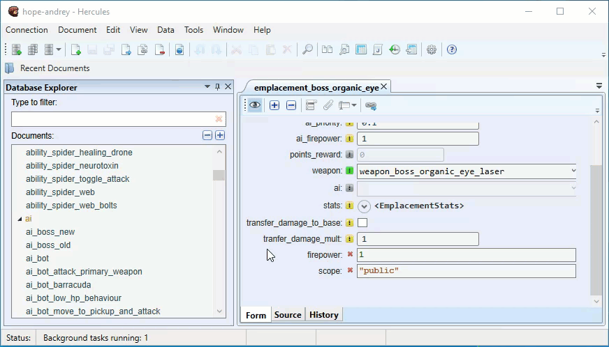

Saving Documents
---------------------

If you want a document to retain the changes you made to it, you have to save it. You can save a document through any of these methods:

-  Go through **Document** > **Save Document.**

-  Use the Ctrl + S shortcut.

To save multiple documents use the Ctrl + Shift + S shortcut.

Copying and Pasting Data 
-----------------------------

Hercules provides several functions that allow you to copy and paste data:

-  Basic Copy and Pasting

..

   You can use a standard copy and paste function similar to the one in text editors.

-  Advanced Copying and Pasting

..

   You can use the advanced functionality that allows you to copy

-  **Data in other forms**. For example, you can copy the file path for parameter A and then paste it for parameter B.

-  **Large data chunks**. For example, you can copy the values from nested field A and then paste them in nested field B.

.. figure:: images/manual/image27.gif

This is how you do advanced copying and pasting:

1. Locate the element you want to copy and click its name.

2. Copy the element’s contents or data through any of these methods:

-  Use the Ctrl + C shortcut.

-  Right-click the element and then select **Copy**.

-  Click the copy icon on the toolbar.

3. Locate the element in which you want to paste the copied contents or data, click its name, and then do any of these:

-  Use the Ctrl + V shortcut.

-  Right-click the empty field and then select **Paste**.

-  Click the paste icon on the toolbar.

You can also duplicate child items with their lists of values and paste values from the clipboard as new child items this way:

1. Right-click the preferred child item with a list of values and then select **Duplicate.**

.. figure:: images/manual/image28.gif

2. Right-click the preferred item and then select **Paste Child**.

.. figure:: images/manual/image29.gif

Cloning Documents 
----------------------

If you want to use the data from one document in another document, you
can clone the document. This way, you get a copy of the original
document without having to create a new document from scratch.

1. Access the clone function through any of these methods:

-  Right-click the document you want to clone and then select **Clone Document**.

-  Select the document and then press F5.

-  Select the document you want to clone (to get it highlighted) and then go through **Document** > **Clone Document**.

2. Type in your preferred name for the cloned document. Click **OK**.

.. note:: The same naming rules and conventions apply to cloned documents.

You have to save the new document to complete the cloning process (see `Saving Documents <#saving-documents>`__).

Multi Cloning Documents
----------------------------

If you want more than one copy of the original document, you can use the **Multi Clone Document** function.

1. Access the required clone function through any of these methods:

-  Right-click the document and then select **Multi Clone Document**.

-  Click the document (to get it highlighted) and then go through **Document** > **Multi Clone Document**.

2. Type in your preferred names for copies of the document line by line (each document name goes on a separate line).

.. note::
 * The same naming *rules and conventions* for new documents apply here.
 *  To complete the cloning operation, you have to save the new documents. See `Saving Documents <#saving-documents>`__\ *.*

Inheriting Documents 
-------------------------

Like the **Clone** function, the **Inherit** function also allows you to create copies of a document. The difference is that Hercules adds a *link* between the original document and inherited copies. Through this link, after you make changes to the original document, you get to update the inherited copies easily.

To inherit a new document, do this:

1. Right-click a document in the Database Explorer and then select **Inherit Document.**

2. Type in your preferred **name** for the inherited document and click **OK**.

The inherited document opens in a new tab. The **Base** parameter at the top of the tab is the name of the original document.

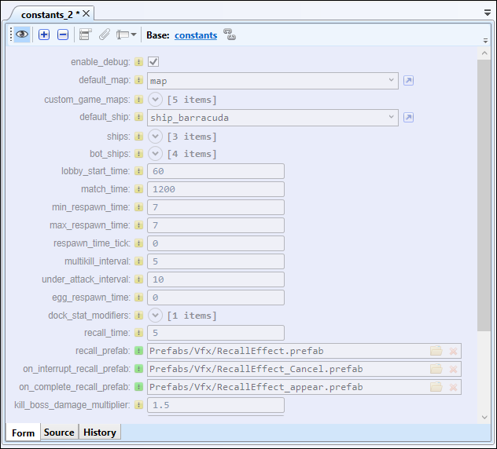

**Updating Inherited Documents**

After you save changes to the original document, Hercules automatically displays a message in the inherited document stating that a new version of the original document is available.

To update the inherited document, click **Rebase**.

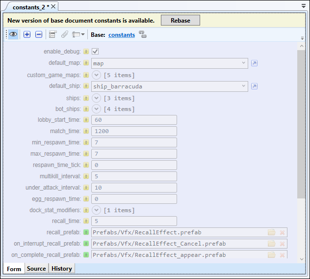

By default, all fields in an inherited document are synced with fields in the original document. But if you edit a certain field in the inherited document directly, Hercules stops syncing that field with its equivalent field in the original document.

Adding Attachments to Documents
------------------------------------

In Hercules, you can store arbitrary data as an attachment to a document.

To add an attachment to a document, do this:

1. Open the document.

2. Click **Add Attachment** at the top of the tab and select a necessary file.

The name of the attached file is displayed at the bottom of the tab.

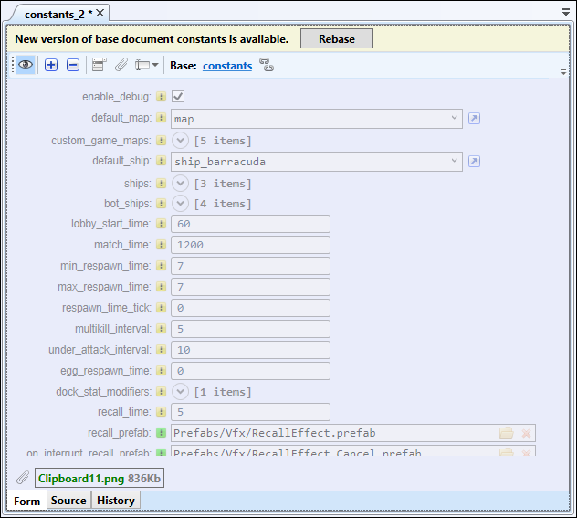

Copying Document name
--------------------------

Hercules allows you to copy a document’s name (in plain text) under **Database Explorer** through any of these methods:

-  Select the document and then go through **Document** > **Copy Document Name**.

-  Right-click the document and then select **Copy Document Name**.

Finding Invalid Documents
------------------------------

Documents become invalid for many reasons. For example, when you delete a document from a database without removing the references to it in other documents, those other documents become invalid.

.. seealso:: :ref:`Dirty Documents <dirty-documents>`.

To find invalid documents in the database, go through **Data > Find Invalid Documents**\ *.*

Invalid documents (if found) are opened in separate tabs.

Invalid fields are highlighted in red. You get to make changes to them.

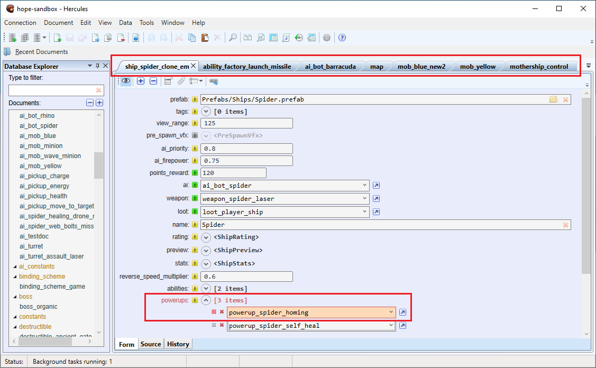

If there are no invalid documents in the database, Hercules displays a message stating that it did not find invalid documents.

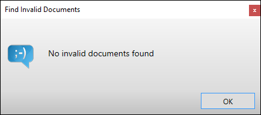

Converting Document Category
---------------------------------

Hercules allows you to convert a document from one category to another. The document gets assigned the schema for the category to which it was converted.

To convert a document to a different category, do this:

1. Open the document you want to convert.

2. From the document tab’s toolbar, click **Convert category**.

3. Click the drop-down menu and select the category to which you want to convert the document.

4. Click **Apply category**.

.. figure:: images/manual/image35.png

Fields that do not comply with the new schema’s requirements are marked as **custom**.

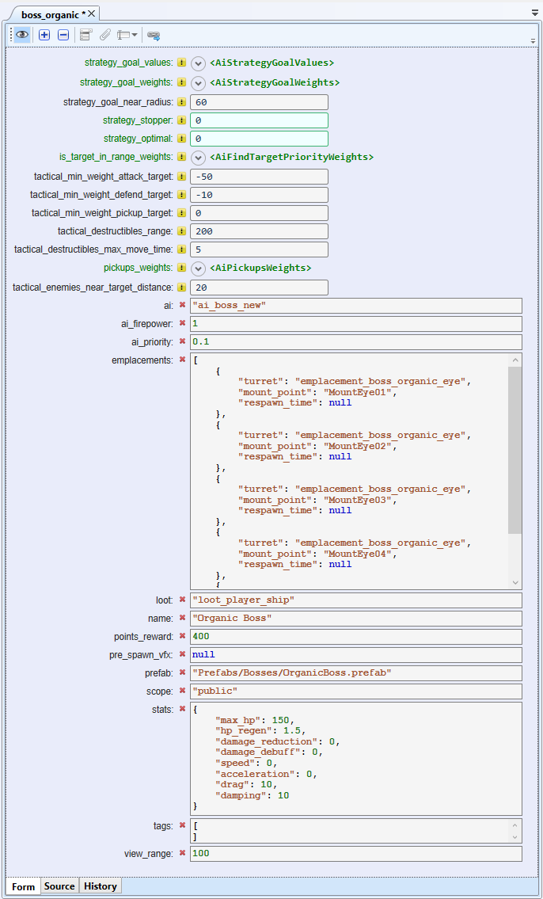

5. To save changes, type valid data into the required fields and click **Save**.

Deleting Documents
-----------------------

.. tip:: Before deleting a document, we recommend you check and confirm that other documents do not contain references to it. See `Finding References to a Document <#finding-references-to-a-document>`__.

When you delete a document to which other documents contain references, those documents become invalid. External databases may also contain references to documents in Hercules and deleting those documents results in bad references.

Before you delete a document, we recommend you take precautions to ensure your action does not result in bad outcomes.

To delete a document from the database, do this:

1. Under **Database Explorer,** select the document you want to delete. To select multiple documents, use the Ctrl + Shift combination.

2. Delete the document through any of these methods:

   -  Go through **Document > Delete Document.**

   -  Under **Database Explorer**, right-click the document and select **Delete Document**.

.. figure:: images/manual/image37.png

.. important:: When you delete documents, they are sent to the **Trash Bin** on the database server where they are retained for a specific time defined in the CouchDB configuration file. During this period, you can recover any deleted document (see `Working with Summary Table <#working-with-summary-table>`__\). After the retention period expires, documents are automatically removed from the Trash Bin.

Working with Summary Table
-------------------------------

The Summary table is a spreadsheet-like overview of all the documents that belong to a specific category.

The Summary table is ideal for bulk document updates.

This is how you work with the Summary Table:

1. Access the Summary Table through any of these methods:

   -  Go through **Data > Summary table.**

   -  Under **Database Explorer**, right-click your preferred category and select **Summary table**.

   -  In the **Form** view, right-click a field and select **Summary table**.

..

   The **Summary Table Columns** window where the chosen field and nested fields are selected by default that will be used as columns in the summary table (see step 3 below).

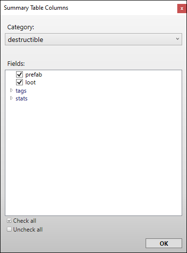

2. If necessary, select the document category you want to use in the summary.

3. Select **other** fields you want to use as columns in your summary table and click **OK**.

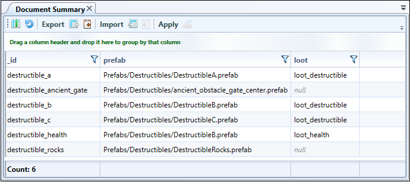

Click on a field to select it. Double click on a field to edit it.

To open a document in a separate tab, double-click its field on the first column.

You can select multiple fields to change several values at once:

-  by clicking and dragging the mouse in the Document Summary or

-  through the Ctrl and Shift keys.

Paste a value. The value will appear in all selected fields.

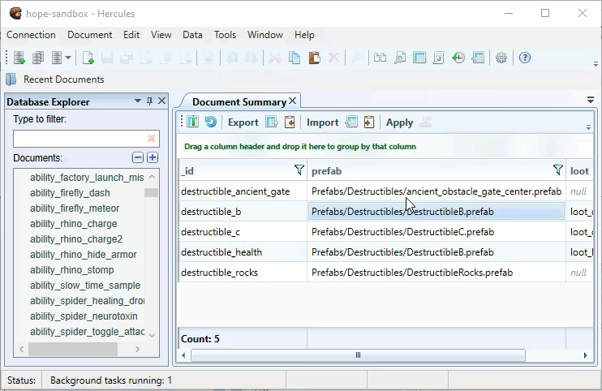

This is how you add or remove columns in Document Summary:

1. From the toolbar under the **Document Summary** tab, click the **Add/Remove column** icon.

2. Select or deselect the checkboxes for the columns.

3. Click **OK**.

To sort the data in a column by ascending or descending order, click the column name.

.. figure:: images/manual/image41.png
	:align: center

**Filtering Data**

1. Click the filter icon on the column name to access the filter dialog.

2. Specify your preferred values. Or use equivalent expressions to temporarily hide some data in the table. This way, you get to focus on only the data you want to see.

.. figure:: images/manual/image42.png
	:align: center

To group data by a column under **Document Summary,** drag and drop the column name around the top of the tab.

.. figure:: images/manual/image43.gif

To cancel grouping, hover your cursor over the item name and then click **Close**.

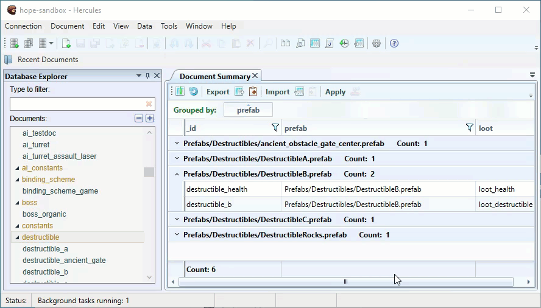

Importing and Exporting Documents 
--------------------------------------

Hercules allows you to import and export documents to the database through different methods. The easiest and quickest method involves the Summary Table.

Importing Documents 
~~~~~~~~~~~~~~~~~~~

When importing data to the Summary Table, you have to organize it as a table in a way that its column names match the column names in the Summary table. The table must contain the id column.

To import documents, do this:

1. Open documents that belong to the same category in the **Summary Table** (see `Working with Summary Table <#working-with-summary-table>`__\). 

.. note:: When importing data to Hercules, you always import documents to a specific document category.

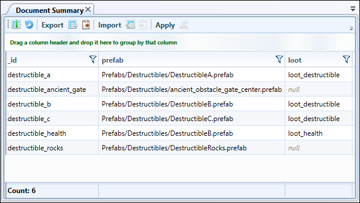

2. From the toolbar under the **Document Summary** tab, click **Import** and then select the file containing the text or spreadsheet you want to import.

You can import files in any of these formats: .xlsx, .xls, .csv, .txt.

3. On the dialog, select the columns you want to import and click **OK**.

During import, you can modify existing documents and create new documents in the Summary table.

-  If you want to create new documents, click the **Allow new documents** option. Otherwise, Hercules will not add such documents to the Document Summary\ **.**

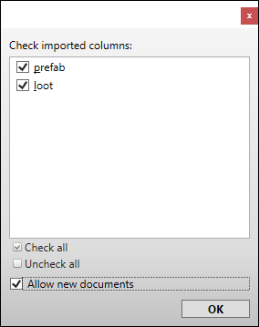

4. Click the **OK** button.

Hercules imports selected data into the **Document Summary**. New values are highlighted in green.

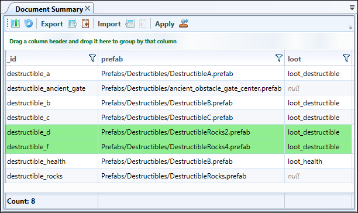

.. hint:: You can also copy values directly from the spreadsheet application and then paste them into the **Document Summary** and vice versa through.

-  the Ctrl + C and Ctrl + V shortcuts or

-  the **Copy Table to Clipboard** and then **Paste Table from Clipboard** buttons (accessed from the toolbar).

**Canceling the operation**

To cancel the import operation and revert to the previous values in the **Document Summary**, click **Refresh**.

**Saving changes**

To save changes to a database, click **Apply**.

Exporting Documents
~~~~~~~~~~~~~~~~~~~

To export documents, do this:

1. Open documents that belong to a single category in the **Summary Table** (see `Working with Summary Table <#working-with-summary-table>`__\).

2. From the **Document Summary** toolbar, click **Export**.

You can export data in these formats: “.xlsx”, “.xls”, “.csv”.

3. In the opened dialog, specify the destination folder, type in the file name and click **OK.**

.. note:: When the **Open spreadsheet after export** option is selected (see :ref:`General <general>`), the file will be opened in a spreadsheet application automatically.

You can also copy values directly from the **Document Summary** and then paste them into the spreadsheet application using the Ctrl + C (or the **Copy Table to Clipboard** button from the toolbar) and Ctrl + V shortcuts.

Importing Documents Using JavaScript
-----------------------------------------

Using JavaScript to import documents is an advanced method. This method is often used to import spreadsheet or JSON data that differs from the data stored in a database.

To import documents into a database, do this:

1. Go through **Data > Import Table.**

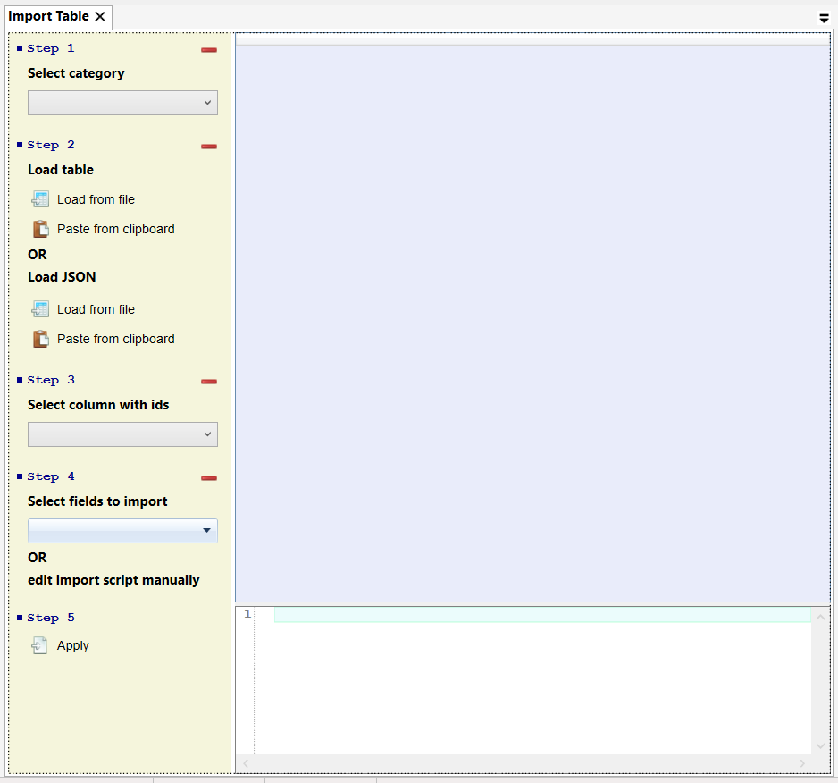

2. On the **Import Table** tab:

   -  **Category**: Select your preferred category for the documents you want to import.

   -  **Load table:** Load data from a spreadsheet file or paste data from the clipboard.

   -  **Load JSON:** Load data from a JSON file or paste data from the clipboard.

.. note:: You can only paste JSON text as an array of multiple JSON objects from the clipboard.

-  **Select column with ids:** Use the drop-down to select the column that contains Ids

-  **Select fields to import:** Use the drop-down list to select the fields you want to import.

-  Edit the JavaScript code directly.

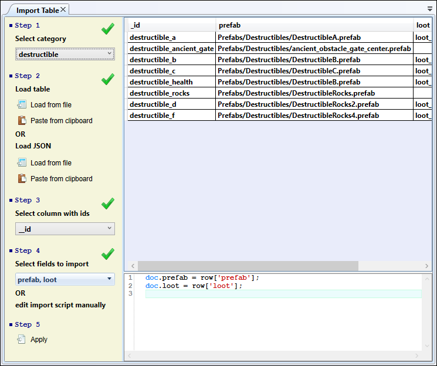

3. Click **Apply** to finish.

Sharing Links to Documents
-------------------------------

If you want someone to quickly access or open a document, you can create a link to that document and then share the link with the person.

You can create 2 types of links to documents:

-  **Hercules links:** These links are designed to be opened and used in Hercules.

-  **Browser links:** These links are designed to be opened and used in a browser.

Creating a Hercules link
~~~~~~~~~~~~~~~~~~~~~~~~

Select the document for which you want to create a link under **Database Explorer** and then go through **Document > Copy Hercules URL.**

.. important:: Hercules has to be installed on the receiver’s computer (where the Hercules link is supposed to be used).

Clicking the link opens the document in Hercules.

.. hint:: Your work does not get disrupted when you open a link to a document. When you click the link, Hercules opens a new program instance, sets up a new connection (if you are not yet connected to the database), and opens the document.

Creating a browser link
~~~~~~~~~~~~~~~~~~~~~~~

Under **Database Explorer**, click the document for which you want to create a link and then go through **Document > Copy Fauxton URL.**

.. note:: Fauxton is a native CouchDB editor.

Pasting the link into any browser opens the document. If necessary, you can edit the document and then save the changes.

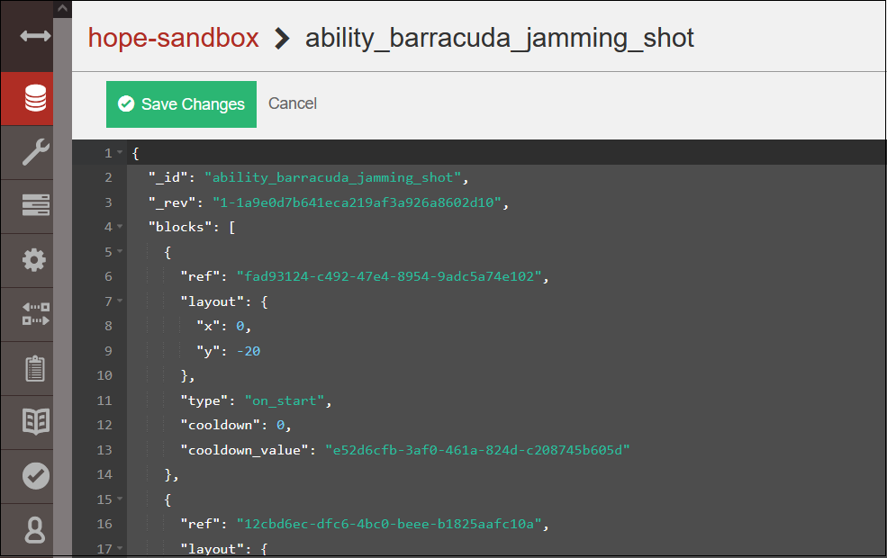

Working With Diagrams
--------------------------

Hercules provides the Diagram Editor to allow you to work with graph data. You can view, edit and create new graph documents.

.. figure:: images/manual/image51.png

Use the **Pointer** and **Pan** buttons on the document’s toolbar to toggle between selecting diagram blocks and panning around in the working area.

In **Select mode**, you can click a diagram element to select it.

-  If you want to select multiple diagram elements at once, draw a selection box around those elements.

-  You can also select and deselect diagram elements by holding the Ctrl key and then clicking the elements.

After selecting a block element, you can resize it, move it to a different position or edit its properties.

In **Pan mode**, click and drag to quickly move around the working area.

.. tip:: In **Select mode**, pressing and holding the scroll wheel activates the pan tool if pan mode is not active.

Use the **Toolbox** panel to add new elements to the diagram.

Diagram elements available on the Toolbox are defined by the document schema and are specific to document categories.

To quickly zoom in and out of a diagram, use your mouse wheel.

You can use the **Zoom** button to access the Navigator panel. This panel allows you to quickly change the view of your diagram using a thumbnail display. The red-colored box in the Navigator panel corresponds to the working area in the **Diagram Editor**.

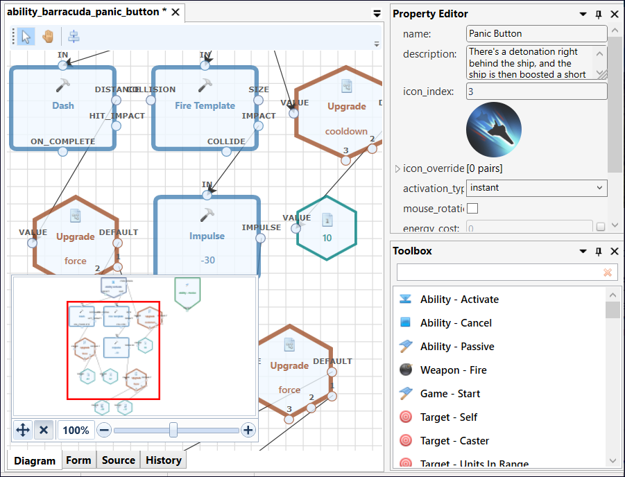

To adjust a diagram’s dimensions, use the auto-fit and automatic layout buttons.

Undoing and Redoing Actions
--------------------------------

Using the **Undo** and **Redo** buttons on the toolbar, you can easily undo and redo changes made to documents. You can also use the Ctrl+Z and Ctrl+Y shortcuts.