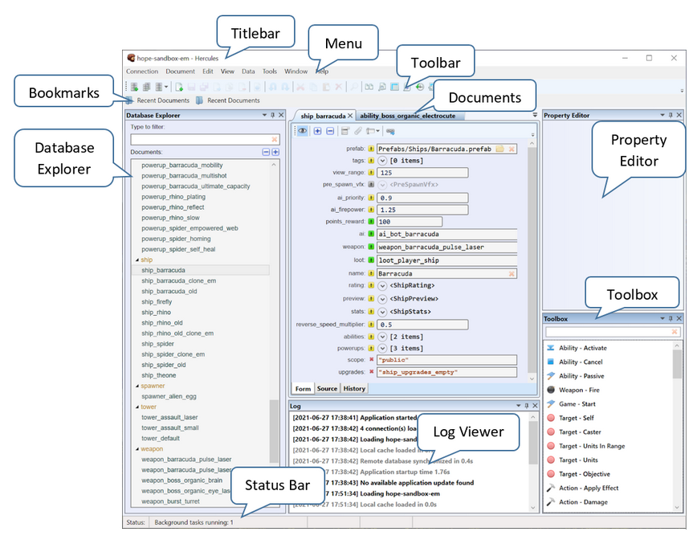

Introduction
===============

Overview
------------

About Hercules
~~~~~~~~~~~~~~~~~~~~

Hercules is a data editing tool used to work with design and
configuration data for software projects (games included). It provides
many editing options.

This is an overview of Hercules main window:

Main Features
~~~~~~~~~~~~~~~~~~~

-  Schema-powered rich data editing forms with input validation

-  Highlighting of modified fields

-  Source view for direct editing of JSON data

-  Bulk document editing via summary tables

-  Undo and Redo actions

-  Quick recovering of deleted documents via trash bin

-  Data importing from CSV, XLS, JSON, and Google Sheets

-  Data importing and transformation using JavaScript

-  Data exporting

-  Customizable data search tool

-  Document version control

-  Exportable database history

-  Synchronization of document data across databases

-  Viewing and editing of diagrams

-  API-powered scripting system for advanced data manipulation

Supported Data Formats
~~~~~~~~~~~~~~~~~~~~~~~~~~~~

Hercules manages data in a JSON-based document format stored in Apache
CouchDB.

Hercules For Game Designers
~~~~~~~~~~~~~~~~~~~~~~~~~~~~~~~~~

-  Universal data editor that works with all kinds of game design data

-  Lightweight design cycle without technical routines: launching heavy engine editors, submitting changes to version control systems, making builds, performing installations, waiting for playtests to start, and receiving feedback

-  On-the-fly design changes in single-player and multiplayer sessions

-  Game backend server may be permitted to access documents

-  Documents are similar to prefabs in Unity and blueprints in Unreal Engine

-  Document categories define the different design objects in the game (characters, items, abilities, weapons, etc.)

-  Ideal for rule-based games, data-driven designs, and massive multiplayer sessions yet less suitable for scripted and story-based games

-  Compared to Unreal Engine 4 blueprint binary formats, JSON-based documents permit collaboration among multiple users

-  Encourages creative user input with a possibility to experiment with game design in practice

.. _naming-rules:

Naming Rules and Conventions in Hercules
~~~~~~~~~~~~~~~~~~~~~~~~~~~~~~~~~~~~~~~~~~~~~~

To name documents correctly, pay attention to these recommendations:

-  The name must be **unique**. A document cannot share the same name with another document.

-  Only **lowercase Latin letters** and **numbers** are allowed.

-  Capitals are allowed, but we strongly recommend you use lowercase letters.

-  **Underscore (_)** is the only special character allowed. Use it to make space.

-  Special characters and spaces are **NOT** allowed.

-  We recommend you prefix the document name with its category (i.e., character, weapon, ability). The category determines the schema in which a document gets formatted and the information it gets to hold.

Installing Hercules
--------------------

To use Hercules, your machine must be running Windows 10.

This is how you install Hercules:

1. Get Hercules at TODO.

2. Run the executable and install the program.