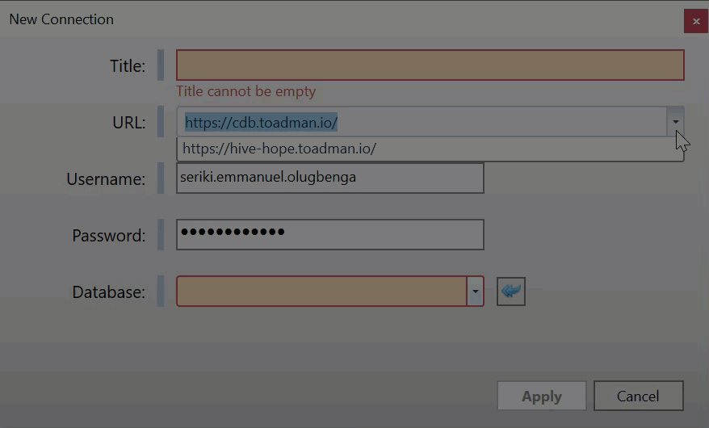

Quick Start: Sample Workflow
===============================

Initialize a Database 
------------------------

Normally, to use Hercules, you connect to an existing database.

When you open Hercules for the first time, Hercules brings up the **New Connection** window. You can connect to a database from there.

Otherwise, to connect to a database, go through **Connection** > New **Connection**.

In the **URL** field, specify the address of the server where your databases are stored.

In the **Database** field, select the database to which Hercules connects. Fill in your **Username** and **Password**.

.. seealso:: :doc:`connections`.

Examine the Database and Find a document
-------------------------------------------

Assuming you are now connected to a database, you can go through its contents to find the document you need.

.. figure:: images/manual/image3.gif

Clone a Document
-------------------

Cloning allows you to quickly create a new document based on an existing document. You can then edit the new document.

.. tip::  If you do not want to clone a document and prefer to edit a document directly, skip this section, move to the next one.

This is how you clone a document:

1. Click the document and then press F5.

2. Type in a new name for the cloned document.

.. figure:: images/manual/image4.gif

.. seealso:: :ref:`Naming Rules and Conventions in Hercules <naming-rules>`.

Edit Fields in a Document
----------------------------

You can make changes to variables (numbers, files, properties, paths) for different fields.

.. figure:: images/manual/image5.gif

**Color Legend**

In Hercules, fields are marked as either **Required** or **Optional**.

-  **Required** fields are fields with the **yellow exclamation** icon. In a required field, you *always* have to specify a value or insert an object. You *cannot* disable a required field.

-  **Optional** fields are fields with the **green exclamation** icon (when enabled) or the **gray exclamation** icon (when disabled). You *can* disable an optional field (for example, if you do not want to specify a value for it).

To enable or disable an optional field, click its exclamation icon.

.. figure:: images/manual/image6.gif

.. warning:: All values you enter are checked against the document schema. When you type in an invalid value, Hercules highlights the text field with a red theme.

Save Changes to the Document or Database
-------------------------------------------

After you finish editing a document or database, you may decide to save your work.

-  To save changes made to a single document, use the Ctrl + S shortcut or go through **Document** > **Save Document**.

-  To save all the changes made in a database (changes to multiple documents), use the Ctrl + Shift + S shortcut or go through **Document** > **Save All.**